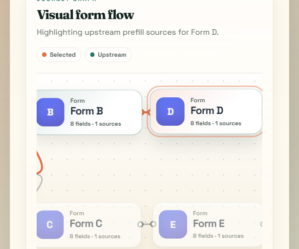
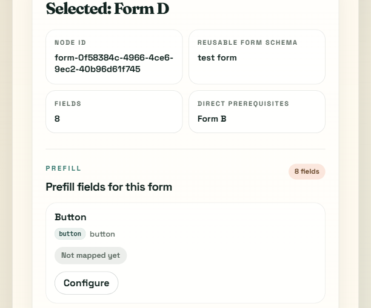
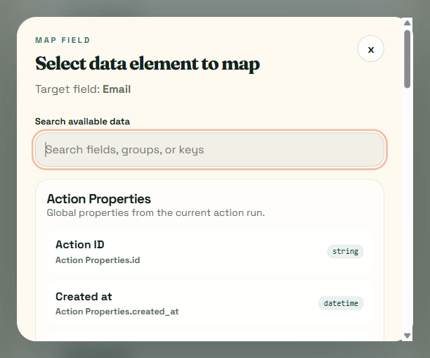

# Avantos Journey Builder Challenge

React + TypeScript submission for the Avantos Journey Builder coding challenge.

The app loads an action blueprint graph from the provided mock server, renders the available form nodes, lets a reviewer select a form, and provides a prefill-mapping workflow for mapping target fields to valid upstream data sources.

## Features

- Fetches the Avantos action blueprint graph from the mock server.
- Displays blueprint summary metadata and all form nodes.
- Shows a dynamic graphical DAG view with clickable form cards and SVG edges.
- Lets users select a form and inspect its schema fields.
- Shows existing prefill mappings from `node.data.input_mapping` when present.
- Computes valid upstream fields from the graph, including direct and transitive ancestors.
- Provides Action Properties and Client Organisation Properties through the same data-source provider system.
- Lets users configure a mapping through a searchable modal.
- Lets users clear mapped or unsupported fields without affecting other mappings.
- Preserves in-session mappings while switching between form nodes.
- Includes responsive layout, accessible control labels, modal autofocus, and Escape-to-close behavior.

## Demo Screenshots

### Dynamic Journey Graph

The graph is rendered from the mock-server DAG data and highlights the selected form plus its upstream prefill sources.



### Prefill Editor

The selected form panel shows form metadata, direct prerequisites, and configurable prefill fields.



### Mapping Modal

The mapping modal uses the same provider system for global data and upstream form fields.



## Challenge Links

- Challenge API docs: https://admin-ui.dev-sandbox.workload.avantos-ai.net/docs#/operations/action-blueprint-graph-get
- Mock server: https://github.com/mosaic-avantos/frontendchallengeserver

## Prerequisites

- Node.js 20.19+ or 22.12+
- npm 10+

## Quick Start

### 1. Start The Mock Server

Clone and run the mock server in a separate terminal:

```bash
git clone https://github.com/mosaic-avantos/frontendchallengeserver.git
cd frontendchallengeserver
npm install
npm start
```

The mock server runs on:

```txt
http://localhost:3000
```

The graph endpoint used by this app is:

```txt
http://localhost:3000/api/v1/1/actions/blueprints/bp_01jk766tckfwx84xjcxazggzyc/graph
```

### 2. Install Frontend Dependencies

```bash
npm install
```

### 3. Run The Frontend

```bash
npm run dev
```

The app starts on the Vite dev server, usually:

```txt
http://localhost:5173
```

The frontend expects the mock server on `http://localhost:3000` unless overridden by environment variables.

## Verification Commands

```bash
npm test
npm run build
npm run lint
```

Current local verification result:

```txt
Test files: 7 passed
Tests: 38 passed
Build: passed
Lint: passed
```

## Environment Variables

The app has sensible defaults for the mock server. To override them, copy
`.env.example` to `.env.local` and edit the values:

```txt
VITE_BLUEPRINT_API_BASE_URL=http://localhost:3000
VITE_BLUEPRINT_TENANT_ID=1
VITE_BLUEPRINT_ID=bp_01jk766tckfwx84xjcxazggzyc
```

## Reviewer Walkthrough

1. Start the mock server.
2. Start the frontend with `npm run dev`.
3. Open the Vite URL.
4. Confirm the blueprint summary loads.
5. Select `Form D` to see direct data from `Form B` and transitive data from `Form A`.
6. Select `Form F` to see a deeper upstream chain across the DAG.
7. Click `Configure` on a prefill field.
8. Search for a data source in the modal.
9. Select a source field and confirm the mapping.
10. Clear the mapping to verify field-level reset behavior.

## Documentation

- `docs/ARCHITECTURE.md`: implementation architecture and module boundaries.
- `docs/CODE_ORGANIZATION.md`: code organization notes for review and future extension.
- `docs/DATA_SOURCE_PROVIDER_GUIDE.md`: how to add a new data source provider.
- `docs/GRAPH_VIEW_NOTES.md`: dynamic visual DAG implementation notes.
- `docs/JOURNEY_BUILDER_PRD.md`: detailed product requirements document.
- `docs/IMPLEMENTATION_PHASES.md`: phase-by-phase implementation checklist.
- `docs/PHASE_1_API_CLIENT.md`: API client and type-layer notes.
- `docs/PHASE_2_GRAPH_DOMAIN.md`: graph indexing and DAG traversal notes.
- `docs/PHASE_3_NODE_SELECTION.md`: form node list and selection UI notes.
- `docs/PHASE_4_PREFILL_PANEL.md`: prefill field rows and mapping display notes.
- `docs/PHASE_5_DATA_SOURCE_PROVIDERS.md`: data source provider architecture notes.
- `docs/PHASE_6_MAPPING_MODAL.md`: mapping modal and source selection notes.
- `docs/PHASE_7_MAPPING_STATE.md`: reducer-backed mapping state and clear behavior notes.
- `docs/PHASE_8_ACCESSIBILITY_POLISH.md`: keyboard, accessibility, and responsive polish notes.
- `docs/PHASE_9_FINAL_HANDOFF.md`: final verification and challenge-criteria review notes.

## Architecture

The code is organized into focused layers:

- `src/api`: graph fetching, URL building, response validation, and error normalization.
- `src/types`: TypeScript contracts for graph, nodes, edges, and form schemas.
- `src/domain`: pure graph traversal, form extraction, mapping display, and data-source contracts.
- `src/providers`: source-specific implementations registered through one provider array.
- `src/state`: reducer-backed client-side mapping overrides.
- `src/components`: React UI components for graph summary, form selection, prefill rows, and modal mapping.

See `docs/ARCHITECTURE.md` for deeper notes.

## Code Organization For Reviewers

The project intentionally keeps business rules out of React components so the workflow can be reused or extended in a larger application.

| Area | Main files | Purpose |
|---|---|---|
| API boundary | `src/api/blueprintClient.ts` | Builds the mock-server graph URL, fetches the graph, validates the response, and normalizes errors. |
| API contracts | `src/types/blueprint.ts` | Defines graph, node, edge, reusable form, field schema, and mapping types. |
| DAG traversal | `src/domain/graph.ts` | Builds graph indexes, resolves direct prerequisites, finds transitive ancestors, and guards against invalid cycles. |
| Form normalization | `src/domain/forms.ts` | Extracts reusable form fields from JSON-schema-like form definitions. |
| Mapping display | `src/domain/mappings.ts` | Converts existing API mappings and user-selected data elements into readable labels. |
| Data sources | `src/domain/dataSources.ts`, `src/providers/*` | Keeps Action Properties, Client Organisation Properties, and upstream form fields behind one provider contract. |
| Mapping state | `src/state/mappingReducer.ts` | Handles set, clear, and per-node mapping overrides without coupling to UI layout. |
| UI composition | `src/components/*` | Renders the graph, form list, selected form summary, prefill panel, source tree, and modal. |
| Tests | `src/**/*.test.ts`, `src/**/*.test.tsx` | Covers API behavior, graph traversal, providers, mapping state, and key user flows. |

See `docs/CODE_ORGANIZATION.md` for a reviewer-focused breakdown of how the app can be extended.

## Add A Data Source Provider

1. Create a provider in `src/providers`.
2. Implement the `DataSourceProvider` interface from `src/domain/dataSources.ts`.
3. Return one or more `DataSourceGroup` objects with selectable `DataElement` children.
4. Register the provider in `src/providers/index.ts`.
5. Add tests for provider output and mapping display if a new source kind is introduced.

See `docs/DATA_SOURCE_PROVIDER_GUIDE.md` for a full example.

## Assumptions

- The mock server runs separately on port `3000`.
- The mock route accepts arbitrary tenant and blueprint IDs.
- Mapping edits are client-side only because the mock server provides graph retrieval but no persistence endpoint.
- Form nodes reference reusable form schemas through `node.data.component_id`.
- The graph is intended to be a DAG, but traversal utilities still guard against invalid cycles.

## Known Limitations

- Mapping changes are not persisted after page reload.
- The graph canvas is custom SVG/HTML rather than React Flow.
- Action Properties and Client Organisation Properties are local provider examples rather than external API-backed schemas.
- The modal includes keyboard basics but not a full focus trap.
- Source and target field type compatibility warnings are not implemented yet.
